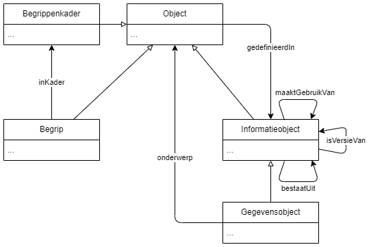
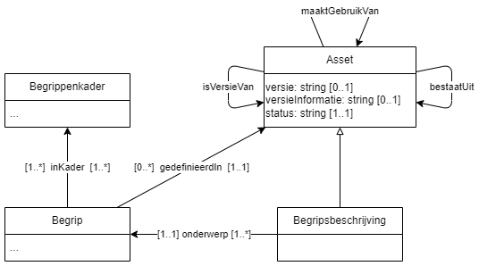

# Model Versiebeheer

## Begrippenmodel

<!--  -->

## Conceptueel model
Toegestane eigenschappen van een asset zijn geselecteerd op basis van [ADMS-AP](https://semiceu.github.io/ADMS/releases/2.00/)

### Asset
#### Verplicht

| Eigenschap   | Rationale |
| ------------ | --------- |
| uitgever     |           |
| beschrijving |           |
| titel        |           |
| type         |           |
#### Aanbevolen

| Eigenschap        | Rationale |
| ----------------- | --------- |
| status            |           |
| versie            |           |
| maakt gebruik van |           |
|                   |           |

#### optioneel

| Eigenschap        | Rationale |
| ----------------- | --------- |
| is versie van     |           |
| versie informatie |           |
| bestaat uit       |           |

### Gegevensobject
#### Verplicht

| Eigenschap | Rationale |
| ---------- | --------- |
| onderwerp  |           |

#### Aanbevolen

| Concept | Rationale |
| ------- | --------- |
|         |           |

#### optioneel
| Eigenschap | Rationale |
| ---------- | --------- |
|            |           |

### Begrip 
#### Verplicht

| Eigenschap      | Rationale |
| --------------- | --------- |
| gedefinieerd in |           |

#### Aanbevolen

| Eigenschap | Rationale |
| ---------- | --------- |
|            |           |

#### optioneel
| Eigenschap | Rationale |
| ---------- | --------- |
|            |           |

### Begrippenkader 
#### Verplicht

| Eigenschap | Rationale |
| ---------- | --------- |
|            |           |
#### Aanbevolen

| Eigenschap | Rationale |
| ---------- | --------- |
|            |           |

#### optioneel
| Eigenschap      | Rationale                                                                                                                                                                                                                 |
| --------------- | ------------------------------------------------------------------------------------------------------------------------------------------------------------------------------------------------------------------------- |
| gedefinieerd in | Voor gevallen waar de asset en het begrippenkader niet dezelfde resource zijn (en dus dezelfde uri hebben) moet er bij het begrippenkader aangegeven in welke asset de beschrijving van het begrippenkader beheerd wordt. |

## Datamodel
Het datamodel is beschreven in SHACL en [hier](skos-versiebeheer-ap-nl.ttl) te vinden

## Taalbinding

