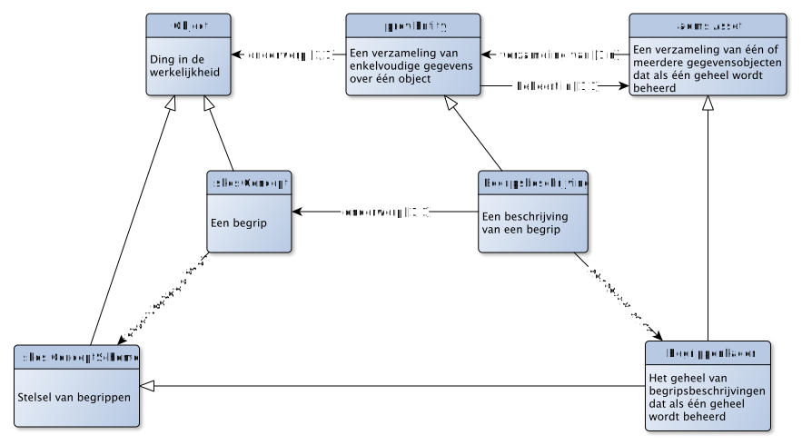

# Taalbinding

De taalbinding die we voorstellen maakt gebruik van de volgende vocabulaires:

- SKOS voor het beschrijven van begrippen;
- ADMS voor het beschrijven van beheer-eenheden;
- PROV voor het beschrijving van herkomstinformatie m.b.t. gegevensobjecten.

Met deze keuze voor de taalbinding is het van belang om rekening te houden met de volgende requirements:

1. Een voorkomen van `skos:Concept` kan onderdeel zijn van meerdere voorkomens van `skos:ConceptScheme`.
2. Elk onderdeel van de beschrijving van een `skos:Concept` wordt beheerd in precies één voorkomen van een `adms:Asset`.

Het gevolg hiervan is dat we twee woorden nodig hebben om de taalbinding met `skos:ConceptScheme` mogelijk te houden:
- Eentje waarbij het gaat om het `skos:ConceptScheme` dat gelijktijdig ook de eenheid van beheer is;
- Eentje waarbij het gaat om een `skos:ConceptScheme`, zonder dat dit een eenheid van beheer hoeft te zijn.

Dit is uitgedrukt in onderstaand figuur.

Het voorstel is om de term "begrippenstelsel" te gebruiken als het puur gaat om een stelsel-van-begrippen en de term "begrippenkader" te gebruiken als sprake is van een stelsel-van-begrippen dat gelijktijdig ook de eenheid van beheer is. Dit is weergegeven in onderstaand figuur (in geval van variant A):

## Voorbeelduitwerkingen.

De uitwerking hiervan voor variant A en variant B is daarmee als volgt:

## Variant A - Begrippenkader als eenheid van beheer

<pre>
  @prefix skos: <http://www.w3.org/2004/02/skos/core#>.
  @prefix rdfs: <http://www.w3.org/2000/01/rdf-schema#>.
  @prefix owl: <http://www.w3.org/2002/07/owl#>.
  @prefix dct: <http://purl.org/dc/terms/>.
  @prefix adms: <http://www.w3.org/ns/adms#>.

  <http://nlbegrip.nl/synthesizer#> a skos:ConceptScheme, adms:Asset, owl:Ontology;
    rdfs:label "Synthesizer begrippen";
    rdfs:comment "Dit begrippenkader is zowel een begrippenstelsel, een beheereenheid als de vindplek van de meest actuele versie";
    owl:versionInfo "Versie 1.0.0 snapshot 1";
    rdfs:isDefinedBy <http://nlbegrip.nl/synthesizer>;
  .
  <http://nlbegrip.nl/synthesizer/1.0.0-snapshot-1> a owl:Ontology;
    rdfs:label "Versie 1.0.0 snapshot 1 van het begrippenkader voor synthesizers";
    dct:isVersionOf <http://nlbegrip.nl/synthesizer#>;
  .
  <http://nlbegrip.nl/synthesizer/id/begrip/synthesizer> a skos:Concept;
    rdfs:label "Synthesizer"@nl;
    skos:prefLabel "Synthesizer"@nl;
    skos:definition "Een synthesizer is een elektronisch muziekinstrument dat klanken en geluiden kunstmatig opwekt."@nl;
    skos:inScheme <http://nlbegrip.nl/synthesizer#>
    dct:source <https://nl.wikipedia.org/wiki/Synthesizer>;
    rdfs:isDefinedBy <http://nlbegrip.nl/synthesizer/1.0.0-snapshot-1>;
  .
  <http://nlbegrip.nl/synthesizer/id/begrip/vco> a skos:Concept;
    rdfs:label "VCO"@nl;
    skos:prefLabel "VCO"@nl;
    skos:altLabel "Voltage Controlled Oscillator"@en;
    skos:definition "Een VCO is een electronische geluidsbron waarbij de frequency van het geluid wordt gecontroleerd met een electrische spanning (voltage)"@nl;
    rdfs:isDefinedBy <http://nlbegrip.nl/synthesizer/1.0.0-snapshot-1>;
  .
</pre>

## Variant B - Begripsbeschrijving als eenheid van beheer

<pre>
  @prefix skos: <http://www.w3.org/2004/02/skos/core#>.
  @prefix rdfs: <http://www.w3.org/2000/01/rdf-schema#>.
  @prefix owl: <http://www.w3.org/2002/07/owl#>.
  @prefix dct: <http://purl.org/dc/terms/>.
  @prefix adms: <http://www.w3.org/ns/adms#>.

  <http://nlbegrip.nl/synthesizer/id/begrip/vco> a skos:Concept;
    rdfs:label "VCO"@nl;
    skos:prefLabel "VCO"@nl;
    skos:altLabel "Voltage Controlled Oscillator"@en;
    skos:definition "Een VCO is een electronische geluidsbron waarbij de frequency van het geluid wordt gecontroleerd met een electrische spanning (voltage)"@nl;
    rdfs:isDefinedBy <http://nlbegrip.nl/doc/begrip/vco/1.0.0-snapshot-1>;
  .

  <http://nlbegrip.nl/synthesizer/doc/begrip/vco> a adms:Asset, prov:Entity, owl:Ontology;
    rdfs:label "Beschrijving van het begrip «VCO»";
    rdfs:comment "Deze beschrijving is zowel een begripsbeschrijving, een beheereenheid als de vindplek van de meest actuele versie van deze begripsbeschrijving";
  .
  <http://nlbegrip.nl/doc/begrip/vco/1.0.0-snapshot-1> a owl:Ontology;
    rdfs:label "Versie 1.0.0 snapshot 1 van de besschrijving van het begrip «VCO»";
    dct:isVersionOf <http://nlbegrip.nl/synthesizer#>;
  .
</pre>
