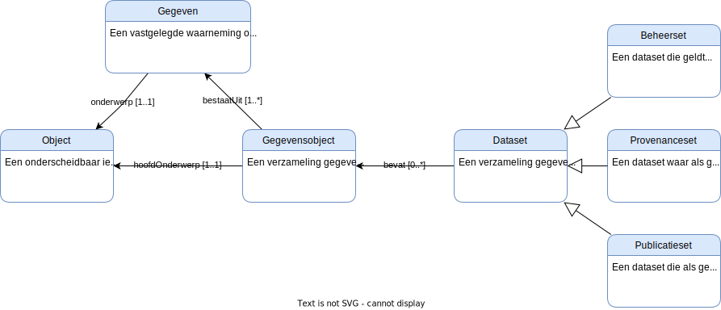
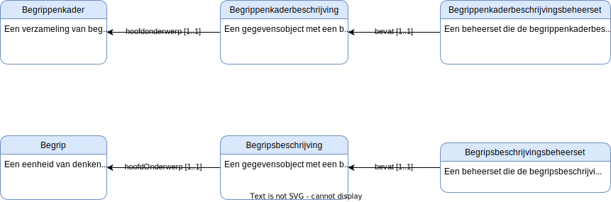
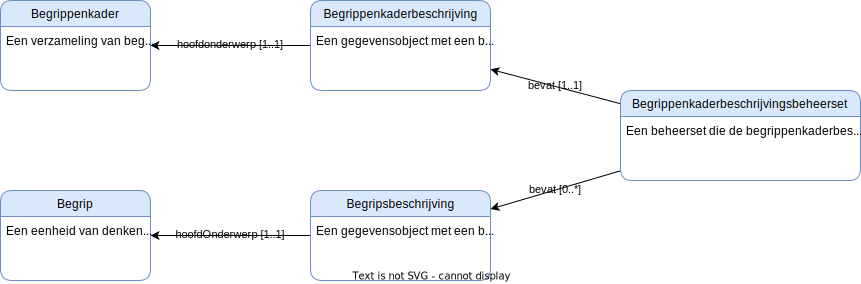
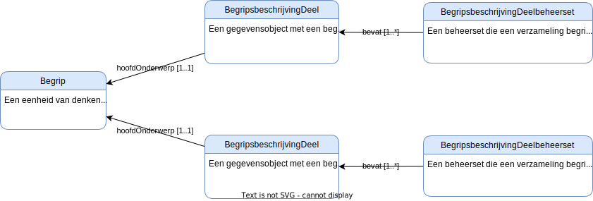

# Varianten voor versiebeheer van begripsbeschrijvingen

Het toepassen van de kernprincipes voor versiebeheer leidt tot het volgende model.

Het uitgangspunt is dat een dataset iets anders is als een gegevensobject en een gegevensobject iets anders is als een object.

## Varianten

Omdat dit model op op veel verschillende manieren te gebruiken is schetsen we hier een aantal voor de hand liggende scenario's voor het inrichten van versiebeheer van begripsbeschrijvingen:

- A. De eenheid van beheer is een complete begripsbeschrijving.
- B. De eenheid van beheer is een begrippenkaderbeschrijving.
- C. De eenheid van beheer is een deel van een complete begripsbeschrijving.

### A. Begripsbeschrijving als eenheid van beheer

Versiebeheer op begripsbeschrijving gaat ervan uit dat er een gegevensobject per begrip in een begrippenkader wordt gemaakt en dat het beheer op dat niveau wordt gereregeld.
Elke wijziging op een individuele begripsbeschrijving heeft geen impact op de andere begripsbeschrijvingen.

### B. Begrippenkaderbeschrijving als eenheid van beheer

Bij versiebeheer op begrippenenkaderbeschrijvingniveau zitten alle gegevensobjecten die horen bij de beschrijving van een begrippenkader onder de beheerset van dat begrippenkader.
Wanneer een begripsbeschrijving wijzigt is er sprake van een nieuwe versie van de begrippenkaderbeschrijving.

### C. Begripsbeschrijving deel als eenheid van beheer

Versiebeheer op een deel van de complete begripsbeschrijving gaat er van uit dat bepaalde gegevens over een begrip tezamen beheerd worden. Ieder begrip heeft zo meerdere, complementaire, beschrijvingen. Deze beschrijvingen kunnen conform Variant A individueel beheerd, of conform Variant B als verzameling beheerd worden.

## Tijdcontext van datasets

Omdat er verschillende manieren zijn om versiebeheer in te richten schrijft dit profiel geen specifieke vorm van versiebeheer voor.

Het is wel van belang om afspraken te maken over hoe de gegevens in een stelsel uitgewisseld moeten worden. 
Een belangrijk aspect voor een stelsel is het in een tijdcontext kunnen relateren van gegevensobjecten.

Daarmee moet van een gegevensobject in ieder geval bepaald kunnen worden

* of het op een gegeven moment geldig was.
* of het op een gegeven moment beschikbaar was.
